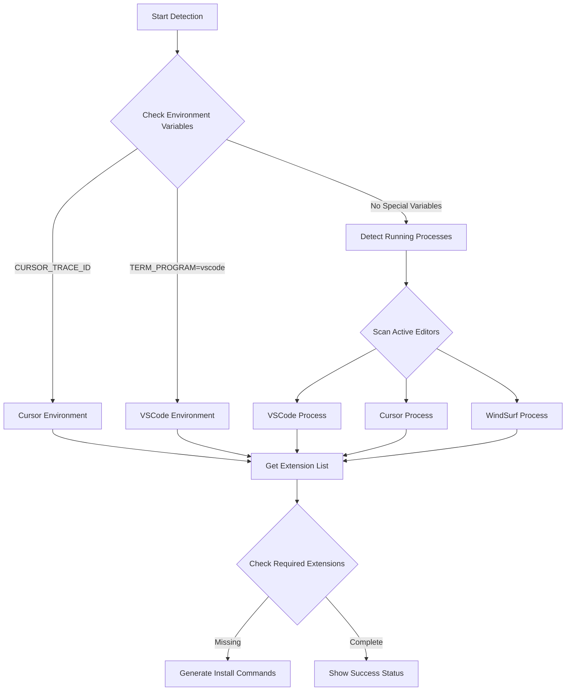

# check-vscode-extensions 

> 🔍 Intelligently detect VSCode/Cursor/WindSurf extension status, support multi-editor environments, provide one-click installation commands

[](https://www.npmjs.com/package/check-vscode-extensions)
[](https://nodejs.org/)
[](LICENSE)
[](https://www.npmjs.com/package/check-vscode-extensions)

Have you ever encountered these situations in team development:

- New team member submits messy code in PR, CI fails
- ESLint errors locally but they have no idea
- You remind them to install extensions, they say "I didn't see the recommendation"


## ✨ Core Features

- 🔍 **Smart Editor Detection** - Automatically identify VSCode, Cursor, WindSurf
- 📊 **Multi-Editor Support** - Detect all running editors simultaneously
- 🛠️ **Path Conflict Resolution** - Intelligently handle `code` command conflicts
- 🎨 **User-Friendly Interface** - Colorful output with clear status indicators
- ⚡ **Precise Installation Guide** - Provide directly executable installation commands
- 📦 **Zero Configuration** - Works out of the box, no complex setup required
- 🌍 **Internationalization** - Support for English and Chinese

## 🚀 Quick Start

### Method 1: Use npx (Recommended)

```bash
npx check-vscode-extensions
```

### Method 2: Global Installation

```bash
npm install -g check-vscode-extensions
check-vscode-extensions
```

### Method 3: Project Integration

```bash
npm install --save-dev check-vscode-extensions
```

Add scripts to your `package.json`:

```json
{
  "scripts": {
    "check:env": "check-vscode-extensions",
    "postinstall": "check-vscode-extensions"
  }
}
```

## 📊 Usage Examples

### ✅ All Extensions Installed
```bash
$ npx check-vscode-extensions
✅ All required extensions are installed in Cursor
ℹ️ 🔍 Detected Cursor is running, checked its extension status.
```

### ⚠️ Missing Extensions
```bash
$ npx check-vscode-extensions
ℹ️ Current editor: VSCode
ℹ️ Missing extensions: dbaeumer.vscode-eslint, esbenp.prettier-vscode

💡 Installation commands (copy and run):
code --install-extension dbaeumer.vscode-eslint
code --install-extension esbenp.prettier-vscode

Or install all at once:
code --install-extension dbaeumer.vscode-eslint && code --install-extension esbenp.prettier-vscode
```

### 🔄 Multi-Editor Detection
```bash
$ npx check-vscode-extensions
ℹ️ Detected multiple editors running: Cursor, VSCode
✅ All required extensions are installed in Cursor
ℹ️ ⚠️ VSCode missing extensions: esbenp.prettier-vscode

Installation commands:

VSCode:
"/Applications/Visual Studio Code.app/Contents/Resources/app/bin/code" --install-extension esbenp.prettier-vscode
```

## 📋 Default Detected Extensions

| Extension ID | Extension Name | Description |
|--------------|----------------|-------------|
| `dbaeumer.vscode-eslint` | ESLint | JavaScript/TypeScript code linting |
| `esbenp.prettier-vscode` | Prettier | Code formatting tool |

## 🎯 Use Cases

### Team Development
```json
{
  "scripts": {
    "postinstall": "check-vscode-extensions"
  }
}
```
Automatically check after project clone, **eliminate extension missing issues**.

### CI/CD Integration
```yaml
# .github/workflows/check-env.yml
- name: Check VSCode Extensions
  run: npx check-vscode-extensions
```

### Git Hooks
```bash
# .husky/pre-commit
npx check-vscode-extensions
```

## 🔧 Customization

Currently, the tool detects a fixed list of extensions. For customization:

### Option 1: Fork and Customize
1. Fork this project
2. Modify the `requiredExtensions` array in `lib/index.js`
3. Publish your own npm package

### Option 2: Local Script
Download the source code to your project and modify directly:

```bash
# Download script
curl -o check-extensions.js https://raw.githubusercontent.com/leeguooooo/check-vscode-extensions/main/lib/index.js

# Modify requiredExtensions array
# Run
node check-extensions.js
```

### Common Extension Examples

```javascript
const requiredExtensions = [
  // Basic extensions
  'dbaeumer.vscode-eslint',
  'esbenp.prettier-vscode',

  // Frontend development
  'bradlc.vscode-tailwindcss',
  'ms-vscode.vscode-typescript-next',

  // Backend development
  'ms-python.python',
  'golang.go',

  // Utility extensions
  'eamodio.gitlens',
  'ms-vscode.vscode-json'
]
```

## 🧠 How It Works

### Smart Detection Flow



### Core Technical Features

- **🔍 Multi-layer Detection**: Environment Variables → Process Scanning → CLI Verification
- **🛠️ Path Conflict Resolution**: Intelligently handle `code` command conflicts
- **📊 Concurrent Editor Support**: Detect multiple running editors simultaneously
- **⚡ Zero Dependencies**: Uses only Node.js built-in modules

## 📊 Comparison with Other Solutions

| Feature | VSCode Recommended Extensions | check-vscode-extensions |
|---------|------------------------------|------------------------|
| Auto-detect extension status | ❌ | ✅ |
| Terminal missing extension alerts | ❌ | ✅ |
| One-click install commands | ❌ | ✅ |
| Support Cursor/WindSurf | ❌ | ✅ |
| Multi-editor detection | ❌ | ✅ |
| CI/CD integration | ❌ | ✅ |
| Zero configuration | ❌ | ✅ |

## 🛠️ Troubleshooting

### Common Issues

#### ❓ Editor Not Detected
Ensure your editor has CLI commands installed and enabled:
- **VSCode**: `Cmd+Shift+P` → "Shell Command: Install 'code' command in PATH"
- **Cursor**: Usually installs `cursor` command automatically

#### ❓ Wrong Editor Detected
Check which editor your system `code` command points to:
```bash
which code
# If it points to Cursor but you want VSCode, reinstall VSCode CLI
```

#### ❓ Permission Errors
Ensure you have permission to execute editor CLI:
```bash
# Test if CLI is available
code --version
cursor --version
```

### Supported Platforms

- ✅ **macOS**: Full support
- ⚠️ **Windows**: Partial support (path adaptation needed)
- ⚠️ **Linux**: Partial support (path adaptation needed)

> Currently optimized for macOS, Windows and Linux support is under development

## 🌍 Language Support

The tool supports multiple languages:

- **English** (default)
- **中文** (Chinese)

Set language via environment variable:
```bash
# English (default)
npx check-vscode-extensions

# Chinese
LANG=zh-CN npx check-vscode-extensions
```

## 🔄 Changelog

### v1.0.0 (2024-01-XX)
- 🎉 Initial release
- ✅ Support VSCode, Cursor, WindSurf detection
- ✅ Multi-editor concurrent detection
- ✅ Smart path conflict resolution
- ✅ Zero dependencies design
- 🌍 Internationalization support

## 🤝 Contributing

We welcome all forms of contributions!

### 🐛 Report Issues
- Use [Issue Templates](https://github.com/leeguooooo/check-vscode-extensions/issues/new)
- Provide detailed environment information and error logs

### 💡 Feature Suggestions
- Discuss in [Discussions](https://github.com/leeguooooo/check-vscode-extensions/discussions)
- Describe use cases and expected outcomes

### 🔧 Code Contributions
1. Fork the project
2. Create feature branch: `git checkout -b feature/amazing-feature`
3. Commit changes: `git commit -m 'feat: add amazing feature'`
4. Push branch: `git push origin feature/amazing-feature`
5. Submit Pull Request

## 📄 License

This project is licensed under the [MIT License](LICENSE).

## 🌟 Star History

If this tool helps you, please give it a ⭐️!

[](https://star-history.com/#leeguooooo/check-vscode-extensions&Date)

---

**🚀 Automate extension checking, make team collaboration more efficient!**

*Made with ❤️ by [leeguoo](https://github.com/leeguooooo)*

## 📖 Documentation

- [中文文档](README.zh-CN.md) - Chinese documentation
- [Usage Guide](USAGE.md) - Detailed usage instructions
- [Release Guide](RELEASE.md) - How to release new versions
