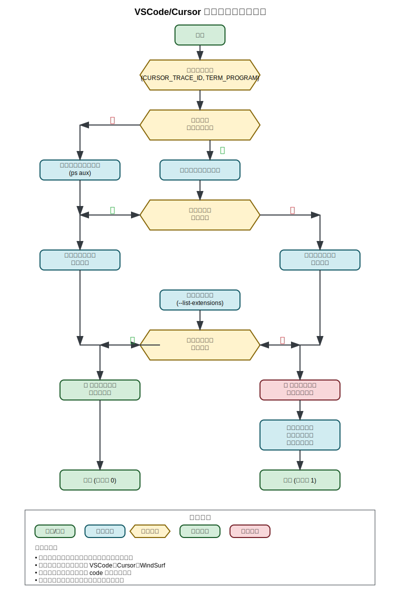

# VSCode/Cursor 插件检测脚本

> 智能检测多编辑器环境下的插件状态，提供精确的安装指导

[](https://nodejs.org/)
[](LICENSE)
[](https://www.apple.com/macos/)

## 🎯 项目简介

这是一个智能的编辑器插件检测脚本，专为解决多编辑器环境下的插件管理问题而设计。无论你使用 VSCode、Cursor 还是 WindSurf，无论在编辑器内置终端还是普通终端运行，都能准确检测插件状态并提供安装指导。

### ✨ 核心特性

- 🔍 **智能编辑器检测** - 自动识别 VSCode、Cursor、WindSurf
- 📊 **多编辑器支持** - 同时检测所有运行中的编辑器
- 🛠️ **路径冲突解决** - 智能处理 `code` 命令指向问题
- 🎨 **友好的用户界面** - 彩色输出，清晰的状态提示
- ⚡ **精确安装指导** - 提供可直接执行的安装命令

## 🚀 快速开始

### 运行脚本

```bash
node scripts/check-vscode-extensions.cjs
```

### 输出示例

#### ✅ 所有插件已安装
```bash
✅ Cursor 已安装所有必要插件
ℹ️ 🔍 检测到 Cursor 正在运行，已检查其插件状态。
```

#### ⚠️ 多编辑器检测
```bash
ℹ️ 检测到多个编辑器正在运行：Cursor、VSCode
✅ Cursor 已安装所有必要插件
ℹ️ ⚠️ VSCode 缺少插件：esbenp.prettier-vscode

安装命令：

VSCode:
"/Applications/Visual Studio Code.app/Contents/Resources/app/bin/code" --install-extension esbenp.prettier-vscode
```

## 📋 检测的插件

| 插件 ID | 插件名称 | 功能描述 |
|---------|----------|----------|
| `dbaeumer.vscode-eslint` | ESLint | JavaScript/TypeScript 代码检查 |
| `esbenp.prettier-vscode` | Prettier | 代码格式化工具 |

## 🔧 自定义配置

### 修改检测的插件

编辑 `scripts/check-vscode-extensions.cjs` 中的 `requiredExtensions` 数组：

```javascript
const requiredExtensions = [
  'dbaeumer.vscode-eslint',
  'esbenp.prettier-vscode',
  'ms-python.python',          // 添加 Python 支持
  'bradlc.vscode-tailwindcss', // 添加 Tailwind CSS
  // 更多插件...
]
```

### 添加新编辑器支持

在 `detectActiveEditors` 函数中添加编辑器配置：

```javascript
const editors = [
  // 现有编辑器...
  { 
    name: 'NewEditor', 
    processNames: ['NewEditor'], 
    cmd: 'neweditor', 
    appPath: '/Applications/NewEditor.app/Contents/Resources/app/bin/code' 
  }
]
```

## 🧠 工作原理

### 检测流程



### 技术架构

1. **环境变量检测** - 识别编辑器内置终端环境
2. **进程检测** - 通过 `ps aux` 检测运行中的编辑器
3. **CLI 路径解析** - 智能处理不同编辑器的命令行工具
4. **插件状态检查** - 使用 `--list-extensions` 获取插件列表
5. **结果展示** - 提供清晰的状态报告和安装指导

### 关键技术点

- **环境变量优先级**：`CURSOR_TRACE_ID` > `TERM_PROGRAM` > 进程检测
- **路径处理**：使用引号包裹路径，处理 macOS 应用路径中的空格
- **错误处理**：优雅降级，提供有用的错误信息
- **用户体验**：彩色输出，emoji 图标，清晰的成功/失败状态

## 📖 文档

- 📄 [详细使用指南](docs/vscode-extension-checker.md)
- 📝 [博客文章模板](docs/blog-post.md)
- 🎨 [流程图](docs/flowchart.svg)

## 🛠️ 故障排除

### 常见问题

#### 检测不到编辑器
确保编辑器已安装并启用 Shell 命令：
- **VSCode**: `Cmd+Shift+P` → "Shell Command: Install 'code' command in PATH"
- **Cursor**: 通常自动安装 `cursor` 命令

#### 路径包含空格错误
脚本已自动处理路径引号，确保复制完整的命令。

#### 检测到错误的编辑器
检查系统 `code` 命令指向：
```bash
which code
```

### 调试模式

在脚本开头添加调试信息：

```javascript
console.log('环境变量:', {
  TERM_PROGRAM: process.env.TERM_PROGRAM,
  CURSOR_TRACE_ID: process.env.CURSOR_TRACE_ID,
  VSCODE_GIT_ASKPASS_MAIN: process.env.VSCODE_GIT_ASKPASS_MAIN
})
```

## 🔄 版本历史

### v2.0 (当前版本)
- ✅ 多编辑器同时检测
- ✅ 智能路径冲突解决
- ✅ 改进的环境变量检测
- ✅ 详细的安装指导

### v1.0
- ✅ 基础编辑器检测
- ✅ 插件状态检查
- ✅ 安装命令生成

## 🤝 贡献

欢迎提交 Issue 和 Pull Request！

### 开发指南

1. Fork 项目
2. 创建功能分支：`git checkout -b feature/amazing-feature`
3. 提交更改：`git commit -m 'Add amazing feature'`
4. 推送分支：`git push origin feature/amazing-feature`
5. 提交 Pull Request

## 📝 许可证

本项目采用 MIT 许可证 - 查看 [LICENSE](LICENSE) 文件了解详情。

## 🙏 致谢

感谢所有为多编辑器环境下的开发体验改进做出贡献的开发者们！

---

**让工具为我们服务，而不是被工具束缚。智能的脚本让开发更加高效！** 🚀

## 📞 联系方式

如果你有任何问题或建议，欢迎：
- 提交 [Issue](../../issues)
- 发起 [Discussion](../../discussions)
- 通过邮件联系

---

*Made with ❤️ for developers who use multiple editors*
