# check-vscode-extensions

> 🔍 智能检测 VSCode/Cursor/WindSurf 插件状态，支持多编辑器环境，提供一键安装命令

[](https://www.npmjs.com/package/check-vscode-extensions)
[](https://nodejs.org/)
[](LICENSE)
[](https://www.npmjs.com/package/check-vscode-extensions)

在团队开发中，你是否也遇到过这样的情况：

- 新人 PR 提交了格式混乱的代码，CI 挂了
- 本地运行 ESLint 报错，但他自己却完全不知道
- 你提醒他装插件，他说"我没看到推荐提示"

👆 如果你点头了，那么这个工具就是为你打造的。

## ✨ 核心特性

- 🔍 **智能编辑器检测** - 自动识别 VSCode、Cursor、WindSurf
- 📊 **多编辑器支持** - 同时检测所有运行中的编辑器
- 🛠️ **路径冲突解决** - 智能处理 `code` 命令指向问题
- 🎨 **友好的用户界面** - 彩色输出，清晰的状态提示
- ⚡ **精确安装指导** - 提供可直接执行的安装命令
- 📦 **零配置使用** - 开箱即用，无需复杂设置

## 🚀 快速开始

### 方式一：使用 npx（推荐）

```bash
# 中文界面
LANG=zh-CN npx check-vscode-extensions

# 英文界面（默认）
npx check-vscode-extensions
```

### 方式二：全局安装

```bash
npm install -g check-vscode-extensions

# 中文界面
LANG=zh-CN check-vscode-extensions

# 英文界面（默认）
check-vscode-extensions
```

### 方式三：项目集成

```bash
npm install --save-dev check-vscode-extensions
```

在 `package.json` 中添加脚本：

```json
{
  "scripts": {
    "check:env": "LANG=zh-CN check-vscode-extensions",
    "check:env:en": "check-vscode-extensions",
    "postinstall": "LANG=zh-CN check-vscode-extensions"
  }
}
```

## 📊 使用示例

### ✅ 所有插件已安装
```bash
$ LANG=zh-CN npx check-vscode-extensions
✅ Cursor 已安装所有必要插件
ℹ️ 🔍 检测到 Cursor 正在运行，已检查其插件状态。
```

### ⚠️ 缺少插件时
```bash
$ LANG=zh-CN npx check-vscode-extensions
ℹ️ 当前编辑器：VSCode
ℹ️ 缺少插件：dbaeumer.vscode-eslint, esbenp.prettier-vscode

💡 安装命令（复制即用）:
code --install-extension dbaeumer.vscode-eslint
code --install-extension esbenp.prettier-vscode

或者一次性安装：
code --install-extension dbaeumer.vscode-eslint && code --install-extension esbenp.prettier-vscode
```

### 🔄 多编辑器检测
```bash
$ LANG=zh-CN npx check-vscode-extensions
ℹ️ 检测到多个编辑器正在运行：Cursor、VSCode
✅ Cursor 已安装所有必要插件
ℹ️ ⚠️ VSCode 缺少插件：esbenp.prettier-vscode

安装命令：

VSCode:
"/Applications/Visual Studio Code.app/Contents/Resources/app/bin/code" --install-extension esbenp.prettier-vscode
```

## 📋 默认检测的插件

| 插件 ID | 插件名称 | 功能描述 |
|---------|----------|----------|
| `dbaeumer.vscode-eslint` | ESLint | JavaScript/TypeScript 代码检查 |
| `esbenp.prettier-vscode` | Prettier | 代码格式化工具 |

## 🎯 使用场景

### 团队开发
```json
{
  "scripts": {
    "postinstall": "LANG=zh-CN check-vscode-extensions"
  }
}
```
项目 clone 后自动检测，**杜绝插件缺失隐患**。

### CI/CD 集成
```yaml
# .github/workflows/check-env.yml
- name: Check VSCode Extensions
  run: LANG=zh-CN npx check-vscode-extensions
```

### Git Hooks
```bash
# .husky/pre-commit
LANG=zh-CN npx check-vscode-extensions
```

## 🔧 自定义配置

目前工具检测固定的插件列表，如需自定义，可以：

### 方案一：Fork 项目自定义
1. Fork 本项目
2. 修改 `lib/index.js` 中的 `requiredExtensions` 数组
3. 发布自己的 npm 包

### 方案二：本地脚本
下载源码到项目中，直接修改：

```bash
# 下载脚本
curl -o check-extensions.js https://raw.githubusercontent.com/leeguooooo/check-vscode-extensions/main/lib/index.js

# 修改 requiredExtensions 数组
# 运行
node check-extensions.js
```

### 常用插件扩展示例

```javascript
const requiredExtensions = [
  // 基础插件
  'dbaeumer.vscode-eslint',
  'esbenp.prettier-vscode',

  // 前端开发
  'bradlc.vscode-tailwindcss',
  'ms-vscode.vscode-typescript-next',

  // 后端开发
  'ms-python.python',
  'golang.go',

  // 工具插件
  'eamodio.gitlens',
  'ms-vscode.vscode-json'
]
```

## 🧠 工作原理

### 智能检测流程

```mermaid
graph TD
    A[启动检测] --> B{检查环境变量}
    B -->|CURSOR_TRACE_ID| C[Cursor 环境]
    B -->|TERM_PROGRAM=vscode| D[VSCode 环境]
    B -->|无特殊环境变量| E[检测运行进程]

    E --> F{扫描活跃编辑器}
    F --> G[VSCode 进程]
    F --> H[Cursor 进程]
    F --> I[WindSurf 进程]

    C --> J[获取插件列表]
    D --> J
    G --> J
    H --> J
    I --> J

    J --> K{检查必需插件}
    K -->|缺失| L[生成安装命令]
    K -->|完整| M[显示成功状态]
```



### 核心技术特点

- **🔍 多层检测机制**：环境变量 → 进程扫描 → CLI 验证
- **🛠️ 路径冲突解决**：智能处理 `code` 命令指向问题
- **📊 并发编辑器支持**：同时检测多个运行中的编辑器
- **⚡ 零依赖设计**：仅使用 Node.js 内置模块

## 📊 与其他方案对比

| 功能 | VSCode 推荐插件 | check-vscode-extensions |
|------|----------------|------------------------|
| 自动检测插件状态 | ❌ | ✅ |
| 缺失插件终端提示 | ❌ | ✅ |
| 一键安装命令 | ❌ | ✅ |
| 支持 Cursor/WindSurf | ❌ | ✅ |
| 支持多编辑器检测 | ❌ | ✅ |
| CI/CD 集成 | ❌ | ✅ |
| 零配置使用 | ❌ | ✅ |

## 🛠️ 故障排除

### 常见问题

#### ❓ 检测不到编辑器
确保编辑器已安装并启用 Shell 命令：
- **VSCode**: `Cmd+Shift+P` → "Shell Command: Install 'code' command in PATH"
- **Cursor**: 通常自动安装 `cursor` 命令

#### ❓ 检测到错误的编辑器
检查系统 `code` 命令指向：
```bash
which code
# 如果指向 Cursor，但你想用 VSCode，需要重新安装 VSCode CLI
```

#### ❓ 权限错误
确保有执行编辑器 CLI 的权限：
```bash
# 测试 CLI 是否可用
code --version
cursor --version
```

### 支持的平台

- ✅ **macOS**: 完全支持
- ⚠️ **Windows**: 部分支持（需要适配路径）
- ⚠️ **Linux**: 部分支持（需要适配路径）

> 目前主要针对 macOS 优化，Windows 和 Linux 支持正在开发中

## 🌍 语言支持

工具支持多种语言：

- **中文**：`LANG=zh-CN npx check-vscode-extensions`
- **英文**（默认）：`npx check-vscode-extensions`

### 自动语言检测

工具会自动检测系统语言环境：

```bash
# 如果系统语言为中文，自动显示中文界面
export LANG=zh-CN.UTF-8
npx check-vscode-extensions
# 输出：✅ VSCode 已安装所有必要插件

# 如果系统语言为英文，自动显示英文界面
export LANG=en_US.UTF-8
npx check-vscode-extensions
# 输出：✅ All required extensions are installed in VSCode
```

### 手动指定语言

```bash
# 强制使用中文
LANG=zh-CN npx check-vscode-extensions

# 强制使用英文
LANG=en npx check-vscode-extensions
```

## 🔄 更新日志

### v1.0.0 (2024-01-XX)
- 🎉 首次发布
- ✅ 支持 VSCode、Cursor、WindSurf 检测
- ✅ 多编辑器并发检测
- ✅ 智能路径冲突解决
- ✅ 零依赖设计

## 🤝 贡献指南

我们欢迎所有形式的贡献！

### 🐛 报告问题
- 使用 [Issue 模板](https://github.com/leeguooooo/check-vscode-extensions/issues/new)
- 提供详细的环境信息和错误日志

### 💡 功能建议
- 在 [Discussions](https://github.com/leeguooooo/check-vscode-extensions/discussions) 中讨论
- 说明使用场景和预期效果

### 🔧 代码贡献
1. Fork 项目
2. 创建功能分支：`git checkout -b feature/amazing-feature`
3. 提交更改：`git commit -m 'feat: add amazing feature'`
4. 推送分支：`git push origin feature/amazing-feature`
5. 提交 Pull Request

## 📄 许可证

本项目采用 [MIT 许可证](LICENSE)。

## 🌟 Star History

如果这个工具对你有帮助，请给个 ⭐️ 支持一下！

[](https://star-history.com/#leeguooooo/check-vscode-extensions&Date)

---

**🚀 让插件检测自动化，让团队协作更高效！**

*Made with ❤️ by [leeguoo](https://github.com/leeguooooo)*
